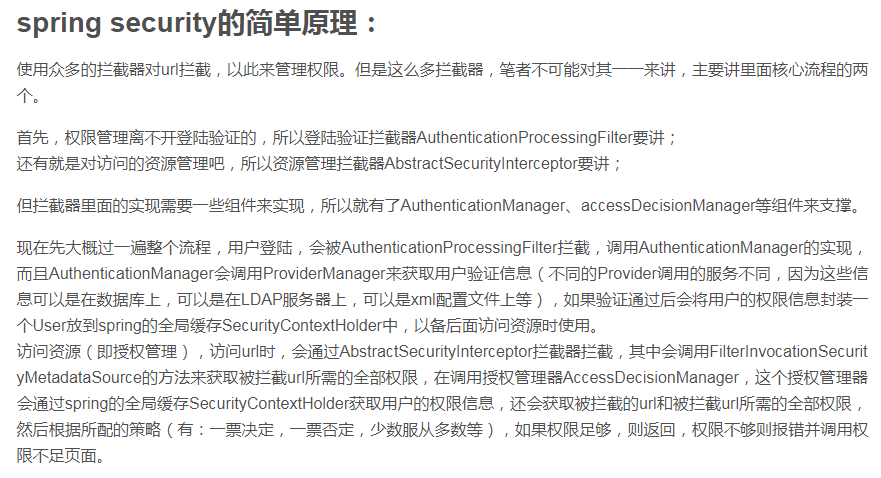
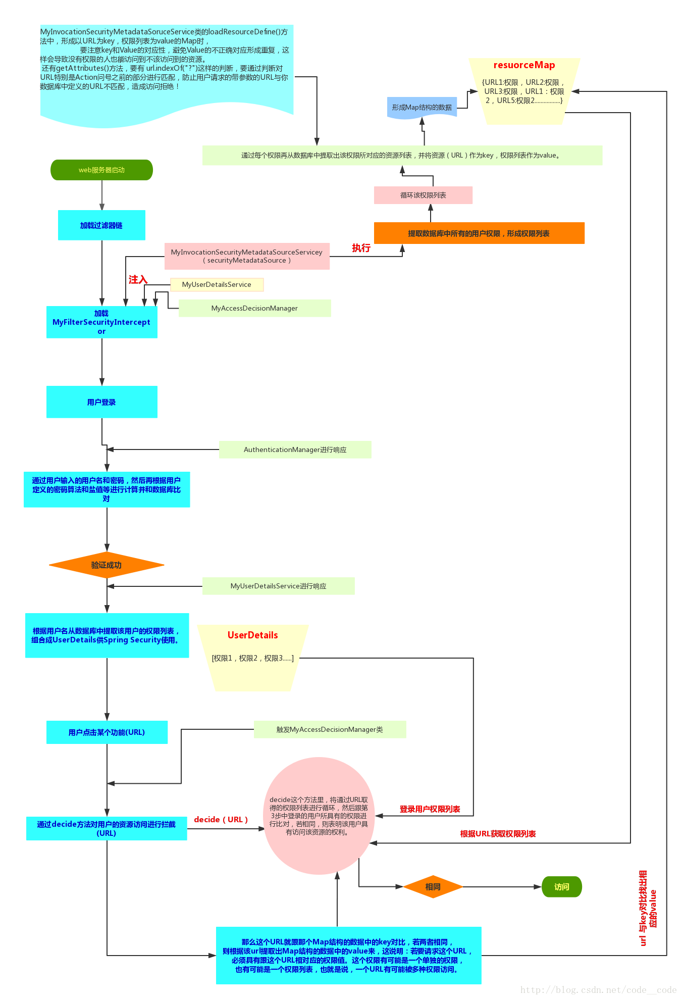
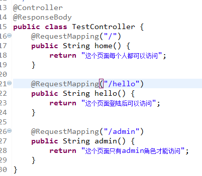
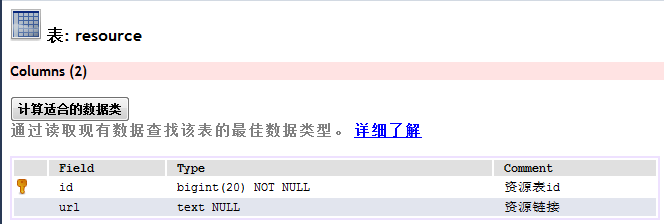
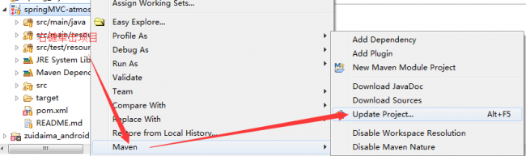
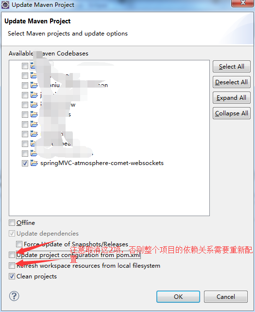

# springsecurity  
### 参考文章  
SpringSide 3 中的安全框架  
详细介绍springsecurity早期版本的设计思路，对理解springsecurity有很大帮助  
http://www.blogjava.net/youxia/archive/2008/12/07/244883.html  
Spring boot+Spring Security 4配置整合实例  
https://blog.csdn.net/code__code/article/details/53885510  
springBoot+springSecurity 数据库动态管理用户、角色、权限（二）  
https://blog.csdn.net/u012373815/article/details/54633046  
### 图示参数  
  
  
### 版本推进  
说明：版本的推进代码请查看代码历史版本  
##### 最简单的demo版本  
该版本未配置用户自定义账户密码。账户密码为user/控制台随机账户密码  
  
访问首页的时候不需要认证，访问欢迎页需要security认证  
##### 内存中实现登陆的demo版本  
有配置内存中的认证,可以配置多个用户，但是没有角色区分,认证账号密码是admin/123456  
访问首页的时候不需要认证，访问欢迎页需要security认证  
##### 内存中实现登陆的demo版本：增加角色控制  
增加了角色控制后，没登陆只能看到没有权限的页面，登陆的还会通过权限进行进一步的判定，角色不通过会被禁止访问  
admin用户有admin权限，账户/密码/权限分别是admin/123456/ADMIN  
zhangsan用户有user权限，账户/密码/权限分别是zhangsan/123456/USER  
如果有角色认证的话，需要ADMIN权限的地方张三是无法进入的  
  
说明：以上都是简单版本，不适用于生产环境，但是可以拿来在小组中使用，仅小组成员通过  
##### 数据库实现登陆的demo版本：增加角色控制  
实现从数据库中读取用户和角色，控制不同角色的用户的访问权限  
在数据库中，zhangsan是user用户，admin是admin角色  
未登录时能访问的页面包括："/","/login","/logout"  
登陆时能访问的页面包括："/hello"  
需要admin角色才能访问的页面包括："/roleAuth"  
##### 数据库实现登录的demo版本：自定义资源分配（初始版本） 
从这个版本开始，已经可以灵活的通过数据库配置资源权限了  
在不需要任何修改之前的业务代码的前提下，比如之前的业务完全是没有添加权限控制的，只需要在数据库中指定，就可以实现为想要增加权限的地方添加上权限  
比如系统原先设置了三个接口，如下  
  
这个时候我在不改变原始代码的前提下，实现权限的分配  
这是个非常好的权限控制，原因有两点：  
1.保证之前无状态的业务代码不需要任何改变，就可以实现权限控制，极大的增加了系统开发的效率  
2.可以实现动态的分配系统权限，相当灵活  
上面两个优点其实从根本上是一个优点：框架无代码侵入性，一个好的框架，就该做到这样  
那么，这个是如何实现的呢？  
前面连接数据库以及实现了两个接口：
实现 UserDetailsService 接口（查出用户所有的角色）  
实现 AuthenticationProvider 接口（自定义用户名和密码验证）  
后面如果增加详细的用户控制，还需要在原来的基础上再实现接口或者继承抽象类，具体如下  
实现 FilterInvocationSecurityMetadataSource 接口（系统启动时将资源和权限的对应信息关联起来）  
实现 AccessDecisionManager 接口（设定资源和角色的匹配规则）  
继承 AbstractSecurityInterceptor 抽象类（使得系统使用上面自定义的匹配规则，不写的话走的还是默认的匹配规则）  
说明：这个版本更新因为时间的关系，暂时还有些地方注释不是很透彻，代码不是很优雅，功能不是很完善，此版本后续还会继续1次优化更新，除此之外，后续可能还会增加一些更新，方便理解springsecurity和新增更多控制  
# 接口  
访问首页{"","/","","$String"}  
访问欢迎页{"","/hello","","$String"}  
访问登陆页{"","/login","",""}  
访问注销页{"","/logout","","$String"}  
访问admin权限页{"","/admin","","$String"}  
# 表结构  
user用户表  
  
role角色表  
  
resource资源表  
  
user_role用户角色表  
  
role_resource角色资源表  
  
# 其他  
### maven报错解决办法  
由于平时经常会去git上面下载一些demo来做参考，常常会通过maven仓库下载jar包，之前配置的阿里云的仓库，但是可能是因为公司的原因，导致这边的网速特别慢  
我手动访问了http://maven.aliyun.com/nexus/content/groups/public/ 仓库地址，发现需要好多秒才能打开，maven下载有时间判定，  
如果超过一定时间就不会下载了，所以我在网上找了几个maven地址，挑几个测试了下，修改后远程仓库后，发现瞬间快了很多，下面这些是地址，大家可以看着修改  
Jcenter http://jcenter.bintray.com/  
Jboss http://repository.jboss.org/nexus/content/groups/public/  
Maven Central http://repo2.maven.org/maven2/  
Ibiblio http://mirrors.ibiblio.org/pub/mirrors/maven2  
UK Maven http://uk.maven.org/maven2/  
OSCHINA http://maven.oschina.net/  
aliyun http://maven.aliyun.com/nexus/content/groups/public/  
maven报错的话，手动去找对应的jar包，删除掉所在的目录，然后mavenupdate一下就ok了  
  
  
### springsecurity权限判断的执行流程  
用户登陆，会被AuthenticationProcessingFilter拦截(即认证管理)，调用AuthenticationManager的实现  
而且AuthenticationManager会调用ProviderManager来获取用户验证信息（不同的Provider调用的服务不同  
因为这些信息可以是在数据库上，可以是在LDAP服务器上，可以是xml配置文件上等），  
如果验证通过后会将用户的权限信息封装一个User放到spring的全局缓存SecurityContextHolder中，以备后面访问资源时使用。   
访问资源（即授权管理），访问url时，会通过AbstractSecurityInterceptor拦截器拦截，  
其中会调用FilterInvocationSecurityMetadataSource的方法来获取被拦截url所需的全部权限，  
在调用授权管理器AccessDecisionManager，这个授权管理器会通过spring的全局缓存SecurityContextHolder获取用户的权限信息，  
还会获取被拦截的url和被拦截url所需的全部权限，然后根据所配的策略（有：一票决定，一票否定，少数服从多数等），  
如果权限足够，则返回，权限不够则报错并调用权限不足页面。  