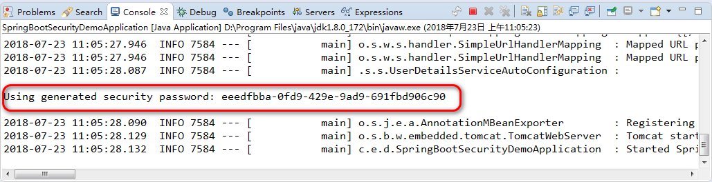
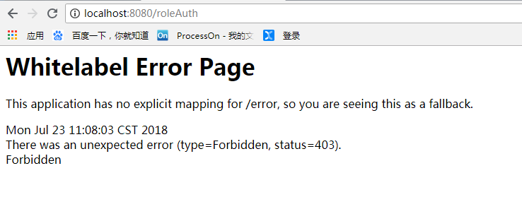
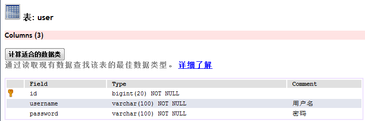
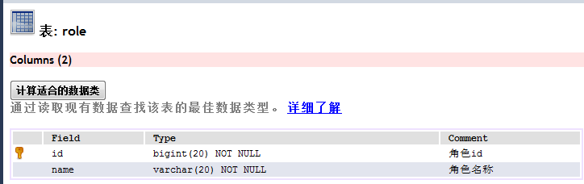
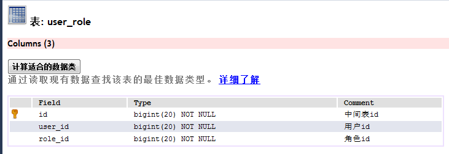

# springsecurity学习笔记  
### 版本推进  
说明：版本的推进代码请查看代码历史版本  
##### 最简单的demo版本  
该版本未配置用户自定义账户密码。账户密码为user/控制台随机账户密码  
  
访问首页的时候不需要认证，访问欢迎页需要security认证  
##### 内存中实现登陆的demo版本  
有配置内存中的认证,可以配置多个用户，但是没有角色区分,认证账号密码是admin/123456  
访问首页的时候不需要认证，访问欢迎页需要security认证  
##### 内存中实现登陆的demo版本：增加角色控制  
增加了角色控制后，没登陆只能看到没有权限的页面，登陆的还会通过权限进行进一步的判定，角色不通过会被禁止访问  
admin用户有admin权限，账户/密码/权限分别是admin/123456/ADMIN  
zhangsan用户有user权限，账户/密码/权限分别是zhangsan/123456/USER  
如果有角色认证的话，需要ADMIN权限的地方张三是无法进入的  
  
说明：以上都是简单版本，不适用于生产环境，但是可以拿来在小组中使用，仅小组成员通过  
##### 数据库实现登陆的demo版本：增加角色控制  
实现从数据库中读取用户和角色，控制不同角色的用户的访问权限  
在数据库中，zhangsan是user用户，admin是admin角色  
未登录时能访问的页面包括："/","/login","/logout"  
登陆时能访问的页面包括："/hello"  
需要admin角色才能访问的页面包括："/roleAuth"  
# 接口  
访问首页{"","/","","$String"}  
访问欢迎页{"","/hello","","$String"}  
访问登陆页{"","/login","",""}  
访问注销页{"","/logout","","$String"}  
访问admin权限页{"","/roleAuth","","$String"}  
# 表结构  
user用户表  
  
role角色表  
  
user_role用户角色表  
  