# springsecurity运行流程的研究  
### springsecurity过滤器执行顺序讲解  
通过查看如下方法  
org.springframework.security.web.FilterChainProxy.doFilterInternal(ServletRequest, ServletResponse, FilterChain)  
可以看到过滤器链中的过滤器  
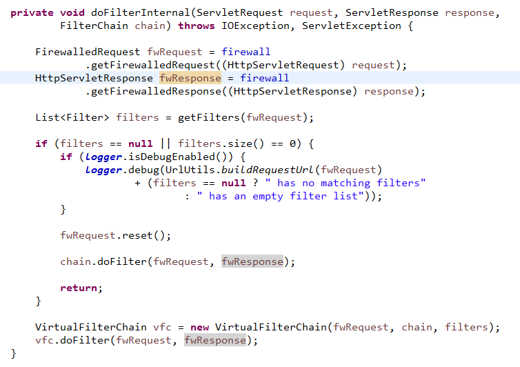  
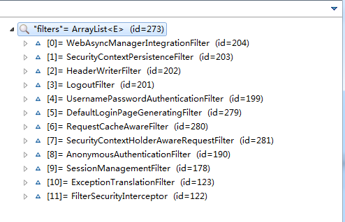  
然后查看下面的方法，可以看到每次走的过滤器是哪个过滤器  
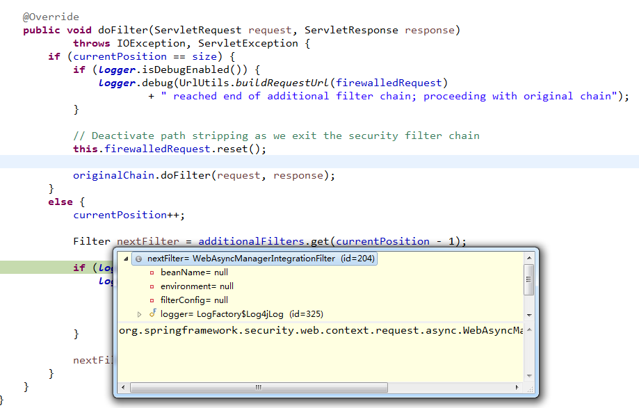  
org.springframework.security.web.FilterChainProxy.VirtualFilterChain.doFilter(ServletRequest, ServletResponse)
最后，我们可以绘出如下流程图  
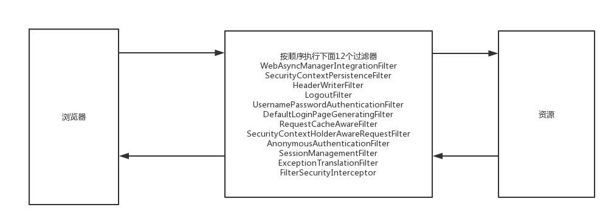  
### 这些过滤器的源码解读  
##### WebAsyncManagerIntegrationFilter  
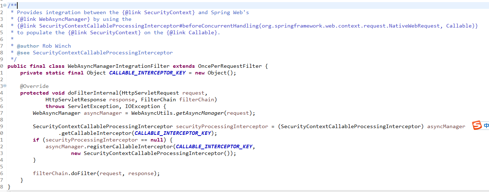  
意思是将SecurityContext整合进WebAsyncManager  
WebAsyncManager的作用参考这个文章https://segmentfault.com/q/1010000009403867  
或者https://docs.spring.io/spring/docs/3.2.2.RELEASE_to_4.0.0.M1/Spring%20Framework%203.2.2.RELEASE/org/springframework/web/context/request/async/WebAsyncManager.html#startCallableProcessing(java.util.concurrent.Callable,%20java.lang.Object...)  
主要用来管理异步请求的处理  
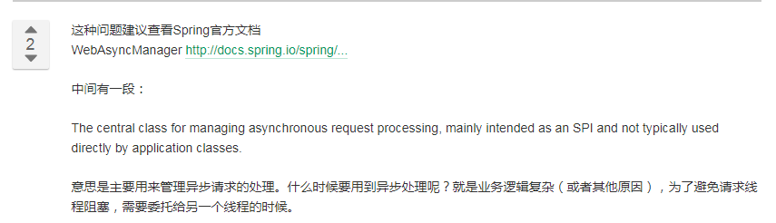  
也就是说，将security放到异步请求中管理，避免导致线程问题  
##### SecurityContextPersistenceFilter  
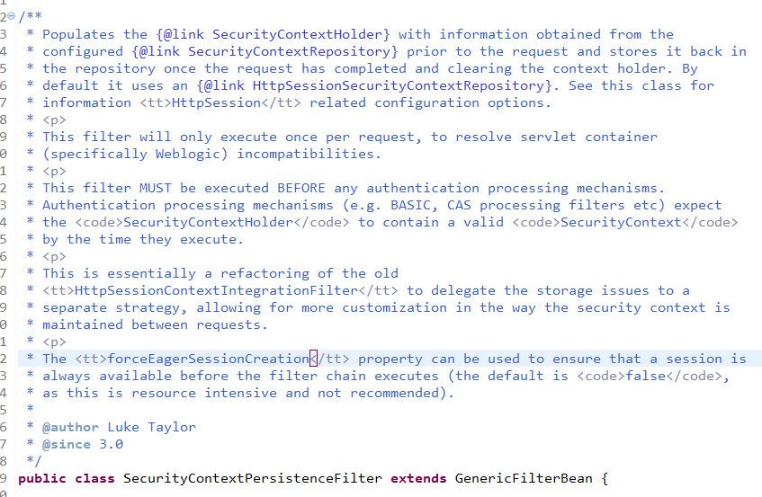  
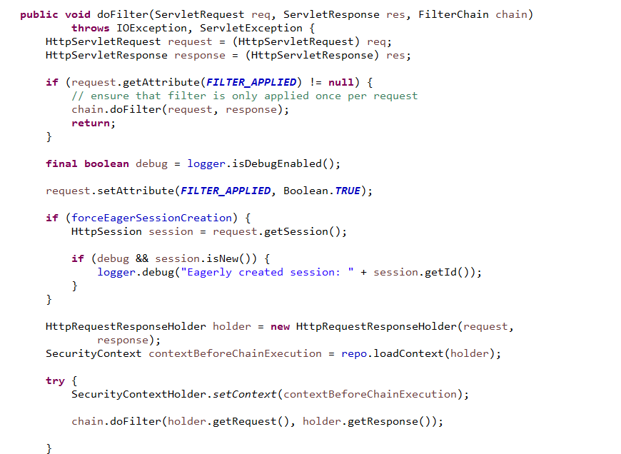  
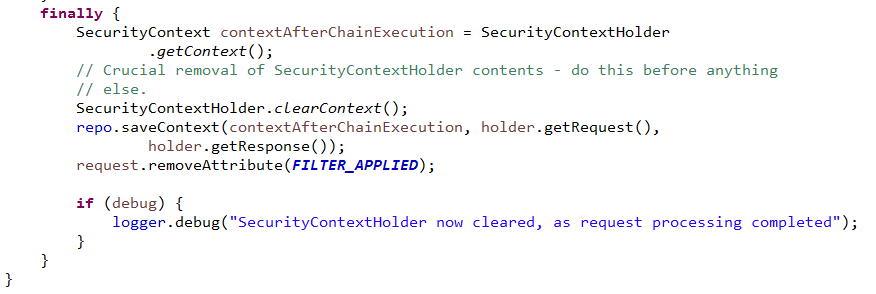  
这个过滤器只会执行一次，而且是在所有认证机制之前就已经执行了，它的功能是  
从SecurityContextRepository中获取SecurityContextHolder然后注入。然后清除原来的SecurityContextHolder信息  
##### HeaderWriterFilter  
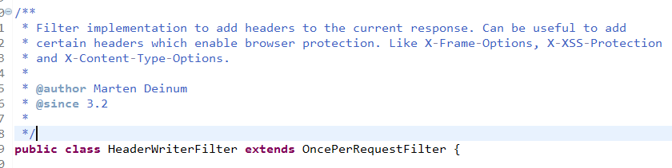  
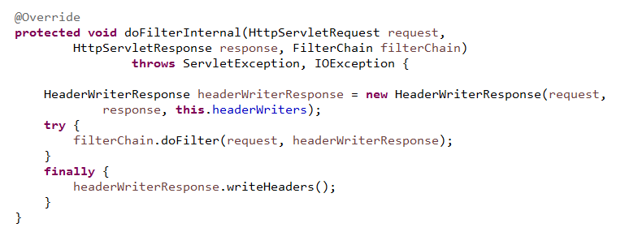  
为当前回复页面增加一些头部信息  
##### LogoutFilter  
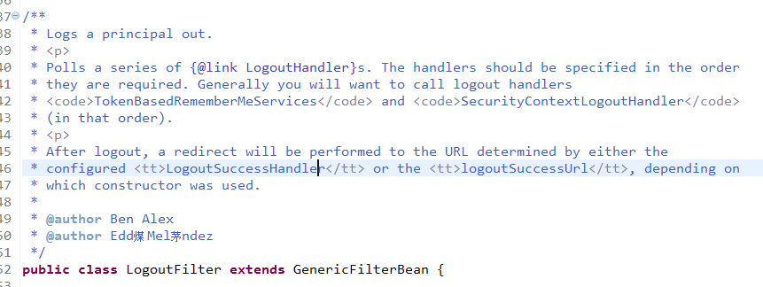  
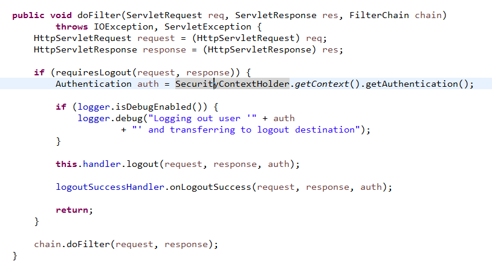  
将用户注销掉  
提供一些列的继承LogoutHandler接口的注销功能参与类，需要特别指顶定  
注销之后，可以通过LogoutSuccessHandler或者logoutSuccessUrl提供的链接进行页面跳转  
##### UsernamePasswordAuthenticationFilter  
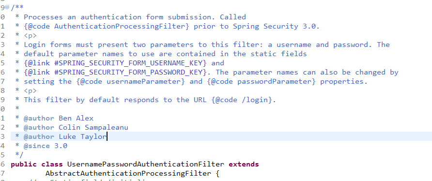  
执行认证的过程  
spring3.0早前的版本叫做AuthenticationProcessingFilter  
登录必须有用户名和密码两个参数，给了两个默认的名字：username，password  
名字可以通过设置usernameParameter和passwordParameter进行修改  
默认拦截/login并作出响应  
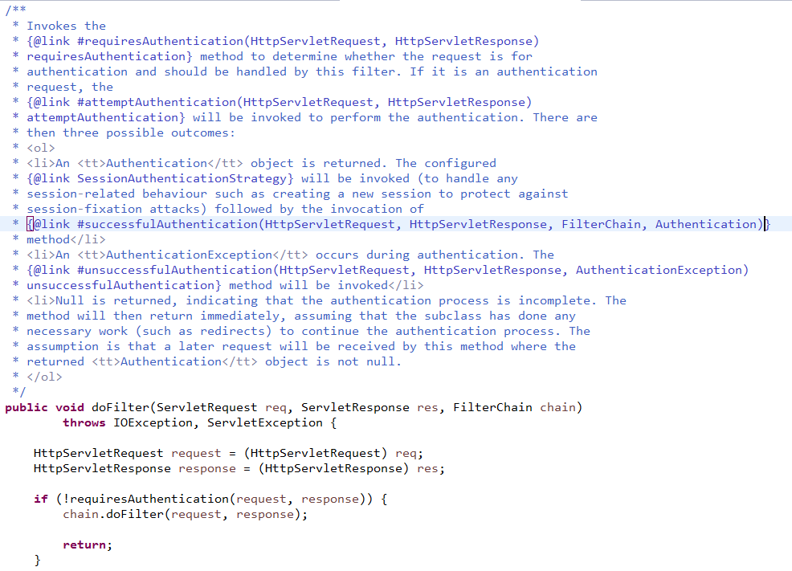  
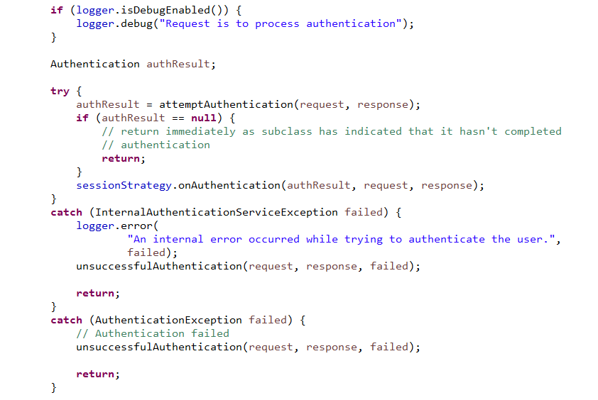  
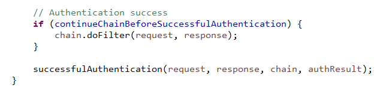  
通过调用抽象父类AbstractAuthenticationProcessingFilter的doFilter方法，执行认证  
AbstractAuthenticationProcessingFilter的认证原理  
通过requiresAuthentication(HttpServletRequest, HttpServletResponse)方法判断是在子类中调用还是在这个类中调用  
如果是在这里面调用的话会有三种结果  
可能需要重新执行之前的认证流程  
执行认证成功流程  
执行认证失败流程  
  
重新执行之前认证的情况，是通过调用org.springframework.security.web.authentication.AbstractAuthenticationProcessingFilter.attemptAuthentication(HttpServletRequest, HttpServletResponse)并且返回值为null  
这个方法其实可以有三种结果：  
1.返回用户的token（成功认证用户）  
2.返回空（用户认证流程未正常执行完成，需要递归继续走完流程）  
3.异常（认证失败）  
##### DefaultLoginPageGeneratingFilter  
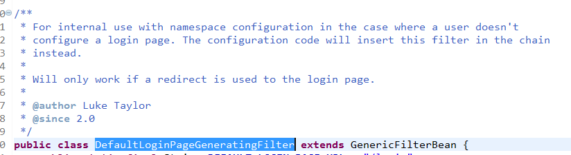  
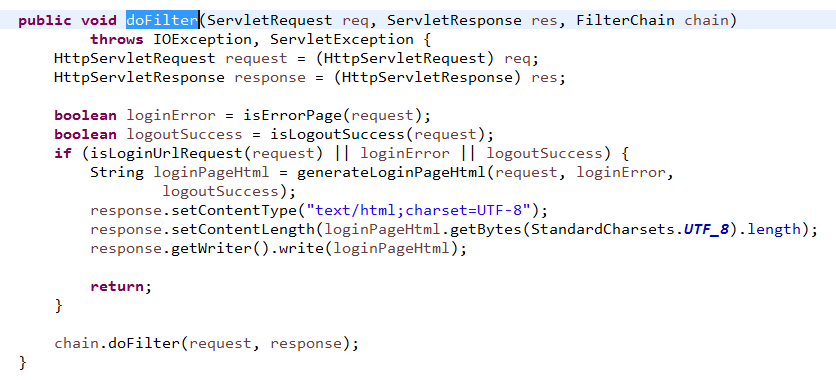  
如果用户没有登录页，可以试着用系统额外提供的登录页  
这个页面是最简单的页面，目的是方便开发者使用security框架，但是绝对不适合用于企业开发，因为很简单  
##### RequestCacheAwareFilter  
用于缓存请求路径的过滤器类，效果是：如果用户在未登陆前就访问了一个需要权限控制的页面，那么就可以通过这个过滤器将页面缓存起来，当登陆验证通过的时候，自动跳转到之前的路径  
##### SecurityContextHolderAwareRequestFilter  
通过一个封装类SecurityContextHolderAwareRequestWrapper，允许用户自定义认证登陆退出等过程  
##### AnonymousAuthenticationFilter  
为没有授权的用户提供一个匿名的权限很小的认证  
##### SessionManagementFilter  
作用是检查用户登录，提高系统安全性  
##### ExceptionTranslationFilter  
异常捕获过滤器  
##### FilterSecurityInterceptor  
为http请求做安全检查的一个过滤器，判断是否经过了安全的校验  
